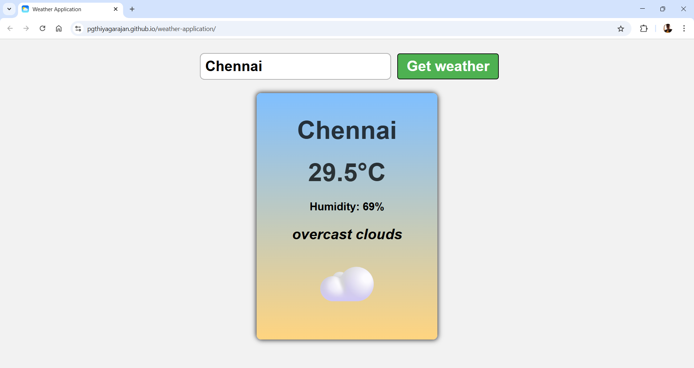
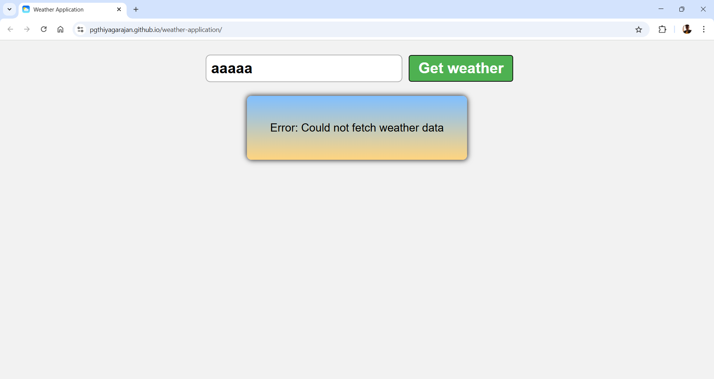

<h1 align="center">⛅ Weather Application ☀️</h1>

  A responsive and elegant JavaScript-based Weather Application that fetches real-time weather data based on city input using the OpenWeatherMap API. Built with simplicity in mind but styled to give a rich user experience.

---

## 🚀 Features

- 🌐 Get real-time weather by city name
- 📊 Displays temperature, humidity, and weather conditions
- 🌤️ Auto-maps weather conditions to matching emojis
- ❌ Graceful error handling for invalid inputs or fetch errors
- 🎨 Clean and responsive UI with gradient-based card design
- 🔒 Uses OpenWeatherMap API securely

---

## 🧑‍💻 Tech Stack

| Technology                                                                                                                                              | Description                                      |
|---------------------------------------------------------------------------------------------------------------------------------------------------------|--------------------------------------------------|
|              | Markup for the structure                         |
|                | Styling and layout (including gradients & cards) |
|  | Core logic and DOM manipulation                  |
| ?style=for-the-badge&logoSize=auto)                           | A free API for live weather data                 |

---

## 📷 Screenshots
 
- 📌 Screenshot 1: Initial UI

- 📌 Screenshot 2: Weather card after city input

- 📌 Screenshot 3: Error message handling

---

## 🙌 Credits

Developed entirely by **Thiyagarajan** — Full Stack Java Developer.

---

Feel free to fork this project, give it a ⭐, and share your feedback!
